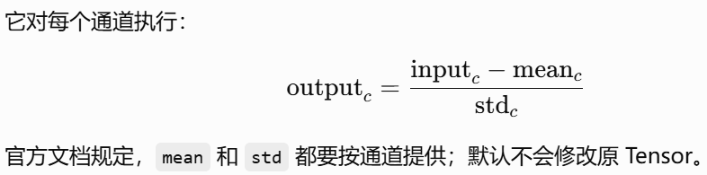
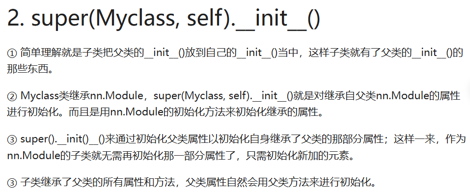
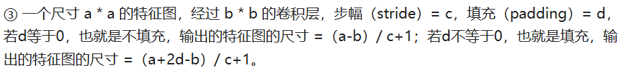

# Day1 

## 103_Pytorch加载数据

**Pytorch中加载数据需要Dataset、Dataloader**

- Dataset提供一种方式去获取每个数据及其对应的label，告诉我们总共有多少个数据。
- Dataloader为后面的网络提供不同的数据形式，它将一批一批数据进行一个打包。


**路径直接加载数据**

```py
from PIL import Image

img_path = "Data/FirstTypeData/train/ants/0013035.jpg"        
img = Image.open(img_path)
img.show()
```


**Dataset加载数据**

```py
from torch.utils.data import Dataset
from PIL import Image
import os

class MyData(Dataset):     
    def __init__(self,root_dir,label_dir):    # 该魔术方法当创建一个事例对象时，会自动调用该函数
        self.root_dir = root_dir # self.root_dir 相当于类中的全局变量
        self.label_dir = label_dir     
        self.path = os.path.join(self.root_dir,self.label_dir) # 字符串拼接，根据是Windows或Lixus系统情况进行拼接               
        self.img_path = os.listdir(self.path) # 获得路径下所有图片的地址
    
    def __getitem__(self,idx):
        img_name = self.img_path[idx]
        img_item_path = os.path.join(self.root_dir,self.label_dir,img_name)            
        img = Image.open(img_item_path)
        label = self.label_dir
        return img, label
    
    def __len__(self):
        return len(self.img_path)

root_dir = "Data/FirstTypeData/train"
ants_label_dir = "ants"
bees_label_dir = "bees"
ants_dataset = MyData(root_dir, ants_label_dir)
bees_dataset = MyData(root_dir, bees_label_dir)
print(len(ants_dataset))
print(len(bees_dataset))
train_dataset = ants_dataset + bees_dataset # train_dataset 就是两个数据集的集合了     
print(len(train_dataset))

img,label = train_dataset[200]
print("label：",label)
img.show()
```


## 105_Transforms使用

**Transforms用途**

- Transforms当成工具箱的话，里面的class就是不同的工具。例如像totensor、resize这些工具。
-  Transforms拿一些特定格式的图片，经过Transforms里面的工具，获得我们想要的结果。


**Transforms如何使用**

1. Transforms.Totensor

   ```py
   from torchvision import transforms
   from PIL import Image
   
   img_path = "Data/FirstTypeData/val/bees/10870992_eebeeb3a12.jpg"
   img = Image.open(img_path)  
   
   tensor_trans = transforms.ToTensor()  # 创建 transforms.ToTensor类 的实例化对象
   tensor_img = tensor_trans(img)  # 调用 transforms.ToTensor类 的__call__的魔术方法   
   print(tensor_img)
   ```

2. 需要Tensor数据类型的原因

   1. Tensor有一些属性，比如反向传播、梯度等属性，它包装了神经网络需要的一些属性。

      ```py
      from torch.utils.tensorboard import SummaryWriter
      from torchvision import transforms
      from PIL import Image
      import cv2
      
      img_path = "Data/FirstTypeData/val/bees/10870992_eebeeb3a12.jpg"
      img = Image.open(img_path)
      
      writer = SummaryWriter("logs") 
      
      tensor_trans = transforms.ToTensor() 
      tensor_img = tensor_trans(img)  
      
      writer.add_image("Temsor_img",tensor_img) 
      writer.close()
      ```

   2. 在 Anaconda 终端里面，激活py3.6.3环境，再输入 tensorboard --logdir=C:\Users\wangy\Desktop\03CV\logs 命令，将网址赋值浏览器的网址栏，回车，即可查看tensorboard显示日志情况。

      `应该是个localhost类型的网址`

   3. 输入网址可得Tensorboard界面。

   

3. 常见的Transforms工具

   - ____call___魔术方法使用

     ```py
     class Person:
         def __call__(self,name):
             print("__call__ "+"Hello "+name)
             
         def hello(self,name):
             print("hello "+name)
             
     person = Person()  # 实例化对象
     person("zhangsan") # 调用__call__魔术方法
     person.hello("list") # 调用hello方法
     
     # __call__ Hello zhangsan
     # hello list
     ```

   - **Normanize归一化**

     改变数值的尺度或表示方式，使数据更容易比较、计算和学习，但尽量保留数据原本的相对关系。

     归一化就像把“厘米、米、公里”暂时换算成同一种标准尺度

     ```PY
     from torch.utils.tensorboard import SummaryWriter
     from torchvision import transforms
     from PIL import Image
     import cv2
     
     img_path = "Data/FirstTypeData/val/bees/10870992_eebeeb3a12.jpg"
     img = Image.open(img_path)
     
     writer = SummaryWriter("logs") 
     
     
     tensor_trans = transforms.ToTensor() 
     img_tensor = tensor_trans(img)  
     
     tensor_trans = transforms.ToTensor() 
     img_tensor = tensor_trans(img)  
     
     print(img_tensor[0][0][0])
     tensor_norm = transforms.Normalize([0.5,0.5,0.5],[0.5,0.5,0.5]) #input[channel]=(input[chnnel]-mean[channel])/std[channel]            
     img_norm = tensor_norm(img_tensor)  
     print(img_norm[0][0][0])
     
     writer.add_image("img_tensor",img_tensor) 
     writer.add_image("img_norm",img_norm) 
     writer.close()
     
     # tensor(0.5725)
     # tensor(0.1451)
     ```

     transforms.Normalize(mean, std, inplace=False)

     mean=[R均值, G均值, B均值]

     std=[R标准差, G标准差, B标准差]

     

   - **Resize裁剪**

     - 裁剪方式1

       ```py
       from torch.utils.tensorboard import SummaryWriter
       from torchvision import transforms
       from PIL import Image
       import cv2
       
       img_path = "Data/FirstTypeData/val/bees/10870992_eebeeb3a12.jpg"
       img = Image.open(img_path)
       print(img)  # PIL类型的图片原始比例为 500×464
       
       writer = SummaryWriter("logs") 
       
       trans_totensor = transforms.ToTensor() 
       img_tensor = trans_totensor(img)  
       
       
       """
       总的来说就是
       PIL数据类型的 img -> resize -> PIL数据类型的 
       然后
       PIL 数据类型的 PIL -> totensor -> img_resize tensor
       """
       trans_resize = transforms.Resize((512,512))
       # PIL数据类型的 img -> resize -> PIL数据类型的 img_resize
       img_resize = trans_resize(img)
       # PIL 数据类型的 PIL -> totensor -> img_resize tensor
       img_resize = trans_totensor(img_resize)
       print(img_resize.size()) # PIL类型的图片原始比例为 3×512×512，3通道
       
       writer.add_image("img_tensor",img_tensor) 
       writer.add_image("img_resize",img_resize) 
       writer.close()
       
       # <PIL.JpegImagePlugin.JpegImageFile image mode=RGB size=500x464 at 0x2C25DF0B320>
       # torch.Size([3, 512, 512])
       ```

     - 裁剪方式2

       ```py
       from torch.utils.tensorboard import SummaryWriter
       from torchvision import transforms
       from PIL import Image
       import cv2
       
       img_path = "Data/FirstTypeData/val/bees/10870992_eebeeb3a12.jpg"
       img = Image.open(img_path)
       print(img)
       
       writer = SummaryWriter("logs") 
       
       tensor_trans = transforms.ToTensor() 
       img_tensor = tensor_trans(img)  
       
       # Resize 第二种方式：等比缩放
       trans_resize_2 = transforms.Resize(512) # 512/464 = 1.103 551/500 = 1.102
       # PIL类型的 Image -> resize -> PIL类型的 Image -> totensor -> tensor类型的 Image
       trans_compose = transforms.Compose([trans_resize_2, trans_totensor]) # Compose函数中后面一个参数的输入为前面一个参数的输出   
       img_resize_2 = trans_compose(img)
       print(img_resize_2.size()) 
       writer.add_image("img_tensor",img_tensor) 
       writer.add_image("img_resize_2",img_resize_2) 
       writer.close()
       
       # <PIL.JpegImagePlugin.JpegImageFile image mode=RGB size=500x464 at 0x2C25DF0B6D8>
       # torch.Size([3, 512, 551])
       ```

   - **RandomCrop随机裁剪**

     - 方式1

       ```py
       from torch.utils.tensorboard import SummaryWriter
       from torchvision import transforms
       from PIL import Image
       import cv2
       
       img_path = "Data/FirstTypeData/val/bees/10870992_eebeeb3a12.jpg"
       img = Image.open(img_path)
       print(img)
       
       writer = SummaryWriter("logs") 
       
       tensor_trans = transforms.ToTensor() 
       img_tensor = tensor_trans(img)  
       writer.add_image("img_tensor",img_tensor) 
       
       trans_random = transforms.RandomCrop(312) # 随即裁剪成 312×312 的
       trans_compose_2 = transforms.Compose([trans_random,tensor_trans])
       for i in range(10):
           img_crop = trans_compose_2(img)
           writer.add_image("RandomCrop",img_crop,i) 
           print(img_crop.size()) 
       ```

     - 方式2

       ```py
       from torch.utils.tensorboard import SummaryWriter
       from torchvision import transforms
       from PIL import Image
       import cv2
       
       img_path = "Data/FirstTypeData/val/bees/10870992_eebeeb3a12.jpg"
       img = Image.open(img_path)
       
       print(img)
       
       writer = SummaryWriter("logs") 
       
       tensor_trans = transforms.ToTensor() 
       img_tensor = tensor_trans(img)  
       writer.add_image("img_tensor",img_tensor) 
       
       trans_random = transforms.RandomCrop((312,100))  # 指定随机裁剪的高和宽  
       
       # 每次调用时，RandomCrop都会重新随机选择剪裁位置。虽然输入始终是同一张img，但通常会得到10张位置不同的裁剪照片
       trans_compose_2 = transforms.Compose([trans_random,tensor_trans])
       for i in range(10):
           img_crop = trans_compose_2(img)
           writer.add_image("RandomCrop",img_crop,i) 
           print(img_crop.size()) 
       ```
       
       **for循环**：是在对**同一张原图随机裁剪 10 次**，并把每次裁剪结果写入 TensorBoard
       
       
       

## 107_Dataloader使用

**Dataloader使用**

-  Dataset只是去告诉我们程序，我们的数据集在什么位置，数据集第一个数据给它一个索引0，它对应的是哪一个数据。
- Dataloader就是把数据加载到神经网络当中，Dataloader所做的事就是每次从Dataset中取数据，至于怎么取，是由Dataloader中的参数决定的。

```py
import torchvision
from torch.utils.data import DataLoader

# 准备的测试数据集
test_data = torchvision.datasets.CIFAR10("./dataset",train=False,transform=torchvision.transforms.ToTensor())               
img, target = test_data[0]
print(img.shape)
print(img)

# batch_size=4 使得 img0, target0 = dataset[0]、img1, target1 = dataset[1]、img2, target2 = dataset[2]、img3, target3 = dataset[3]，然后这四个数据作为Dataloader的一个返回      
test_loader = DataLoader(dataset=test_data,batch_size=4,shuffle=True,num_workers=0,drop_last=False)      
# 用for循环取出DataLoader打包好的四个数据
for data in test_loader:
    imgs, targets = data # 每个data都是由4张图片组成，imgs.size 为 [4,3,32,32]，四张32×32图片三通道，targets由四个标签组成             
    print(imgs.shape)
    print(targets)
```

- DataLoader 每次确实返回 4 个样本，但它不会把 4 个样本作为 4 个独立变量返回，而是把它们沿着一个新的维度堆叠成一个 Tensor。

  - 假设单张图片的 Tensor 形状是：[3, 32, 32]  含义是 [通道数, 高度, 宽度]

  - 当 batch_size=4时，DataLoader 会取 4 张图片，把它们堆叠起来：

    ```py
    imgs.shape
    # torch.Size([4, 3, 32, 32])
    ```

  - 并不是“一个 Tensor 中有 4 个参数”，而是：

    ```
    [样本数量, 通道数, 高度, 宽度]
    [    4,      3,     32,    32]
    
    imgs
    ├── imgs[0]：第 1 张图片，shape = [3, 32, 32]
    ├── imgs[1]：第 2 张图片，shape = [3, 32, 32]
    ├── imgs[2]：第 3 张图片，shape = [3, 32, 32]
    └── imgs[3]：第 4 张图片，shape = [3, 32, 32]
    ```

- `data`的结构

  ```py
  for data in test_loader:
  # 每次循环得到的 data 通常类似于：data = (imgs, targets)
  # 包含两个部分：imgs(这一批的所有图片) targets(这一批图片对应的所有标签)
  
  imgs, targets = data 
  # 等价于 
  imgs = data[0]
  targets = data[1]
  
  # data不是单张图片，它是当前整个批次的数据
  imgs.shape  # [4, 3, 32, 32]
  targets.shape  # [4]
  
  #假设
  targets  # tensor([6, 2, 8, 1])
  
  """那对应关系就是
  imgs[0] 对应 targets[0]，类别为 6
  imgs[1] 对应 targets[1]，类别为 2
  imgs[2] 对应 targets[2]，类别为 8
  imgs[3] 对应 targets[3]，类别为 1
  """
  ```

  

**Tensorboard展示**

```py
import torchvision
from torch.utils.data import DataLoader
from torch.utils.tensorboard import SummaryWriter

# 准备的测试数据集
test_data = torchvision.datasets.CIFAR10("./dataset",train=False,transform=torchvision.transforms.ToTensor())               
# batch_size=4 使得 img0, target0 = dataset[0]、img1, target1 = dataset[1]、img2, target2 = dataset[2]、img3, target3 = dataset[3]，然后这四个数据作为Dataloader的一个返回      
test_loader = DataLoader(dataset=test_data,batch_size=64,shuffle=True,num_workers=0,drop_last=False)      
# 用for循环取出DataLoader打包好的四个数据
writer = SummaryWriter("logs")
step = 0
for data in test_loader:
    imgs, targets = data # 每个data都是由4张图片组成，imgs.size 为 [4,3,32,32]，四张32×32图片三通道，targets由四个标签组成             
    writer.add_images("test_data",imgs,step)
    step = step + 1
    
writer.close()
```


**Dataloader多轮次加载数据**

```py
import torchvision
from torch.utils.data import DataLoader
from torch.utils.tensorboard import SummaryWriter

# 准备的测试数据集
test_data = torchvision.datasets.CIFAR10("./dataset",train=False,transform=torchvision.transforms.ToTensor())               
# batch_size=4 使得 img0, target0 = dataset[0]、img1, target1 = dataset[1]、img2, target2 = dataset[2]、img3, target3 = dataset[3]，然后这四个数据作为Dataloader的一个返回      
test_loader = DataLoader(dataset=test_data,batch_size=64,shuffle=True,num_workers=0,drop_last=True)      
# 用for循环取出DataLoader打包好的四个数据
writer = SummaryWriter("logs")
for epoch in range(2):
    step = 0
    for data in test_loader:
        imgs, targets = data # 每个data都是由4张图片组成，imgs.size 为 [4,3,32,32]，四张32×32图片三通道，targets由四个标签组成             
        writer.add_images("Epoch：{}".format(epoch),imgs,step)
        step = step + 1
    
writer.close()
```


## 108_nn.Module模块使用

**nn.Module模块使用**

- nn.Module是对所有神经网络提供一个基本的类。
- 我们的神经网络是继承nn.Module这个类，即nn.Module为父类，nn.Module为所有神经网络提供一个模板，对其中一些我们不满意的部分进行修改。

```py
import torch
from torch import nn

class Tudui(nn.Module):
    def __init__(self):
        super(Tudui, self).__init__()  # 继承父类的初始化
        
    def forward(self, input):          # 将forward函数进行重写
        output = input + 1
        return output
    
tudui = Tudui()
x = torch.tensor(1.0)  # 创建一个值为 1.0 的tensor
output = tudui(x)
print(output)
```





**forward函数**

-  使用pytorch的时候，不需要手动调用forward函数，只要在实例化一个对象中传入对应的参数就可以自动调用 forward 函数。
-  因为 PyTorch 中的大部分方法都继承自 torch.nn.Module，而 torch.nn.Module 的__call__(self)函数中会返回 forward()函数 的结果，因此PyTroch中的 forward()函数等于是被嵌套在了__call__(self)函数中；因此forward()函数可以直接通过类名被调用，而不用实例化对象。

```py
class A():
    def __call__(self, param):
        print('i can called like a function')
        print('传入参数的类型是：{}   值为： {}'.format(type(param), param))
        res = self.forward(param)
        return res
    
    def forward(self, input_):
        print('forward 函数被调用了')
        print('in  forward, 传入参数类型是：{}  值为: {}'.format( type(input_), input_))
        return input_

a = A()
input_param = a('i')
print("对象a传入的参数是：", input_param)
"""
i can called like a function
传入参数的类型是：<class 'str'>   值为： i
forward 函数被调用了
in  forward, 传入参数类型是：<class 'str'>  值为: i
对象a传入的参数是： i
"""
```


## 109_卷积原理

**卷积原理**

-  卷积核不停的在原图上进行滑动，对应元素相乘再相加。
- 下图为每次滑动移动1格，然后再利用原图与卷积核上的数值进行计算得到缩略图矩阵的数据
- 看图链接：https://github.com/AccumulateMore/CV/blob/main/109_%E5%8D%B7%E7%A7%AF%E5%8E%9F%E7%90%86.ipynb

```py
import torch
import torch.nn.functional as F

input = torch.tensor([[1, 2, 0, 3, 1],
                      [0, 1, 2, 3, 1],
                      [1, 2, 1, 0, 0],
                      [5, 2, 3, 1, 1],
                      [2, 1, 0, 1, 1]])

kernel = torch.tensor([[1, 2, 1],
                       [0, 1, 0],
                       [2, 1, 0]])

print(input.shape)
print(kernel.shape)

"""
input = torch.reshape(input, (1,1,5,5))
torch.reshape(要变形的Tensor, 变形后的形状)

(1, 1, 5, 5)
[batch_size, channels, height, width]
一批中有 1 张图片，这张图片有 1 个通道，高为 5，宽为 5。
"""
input = torch.reshape(input, (1,1,5,5))
kernel = torch.reshape(kernel, (1,1,3,3))
print(input.shape)
print(kernel.shape)

output = F.conv2d(input, kernel, stride=1)
print(output)
```


**步幅(stride)、填充(padding)原理**

- 步幅：卷积核经过输入特征图的采样间隔。设置步幅的目的：希望减小输入参数的数目，减少计算量。
- 填充：在输入特征图的每一边添加一定数目的行列。设置填充的目的：希望每个输入方块都能作为卷积窗口的中心，或使得输出的特征图的长、宽 = 输入的特征图的长、宽。
- 
- 例子1：一个特征图尺寸为4 * 4的输入，使用3 * 3的卷积核，步幅=1，填充=0，输出的尺寸=(4 - 3)/1 + 1 = 2。


