动手学深度学习v2

# 01-15

## 03环境安装

```python
# 创建环境  3.8也ok，最好3.8
  conda create --name d2l python=3.9 -y

# 激活
  conda activate d2l

# 安装包
pip install torch==1.12.0 -i http://mirrors.aliyun.com/pypi/simple/ --trusted-host mirrors.aliyun.com

pip install torchvision==0.13.0  -i http://mirrors.aliyun.com/pypi/simple/ --trusted-host mirrors.aliyun.com

pip install d2l==0.17.6  -i http://mirrors.aliyun.com/pypi/simple/ --trusted-host mirrors.aliyun.com

# 打开方式-- 点开e盘，输入 jupyter notebook
# 或者用pycharm换解释器，一样的

# 没代码的部分可以来这部分看
https://zh-v2.d2l.ai/chapter_convolutional-modern/alexnet.html
```


## 04 数据操作+数据预处理

### 数据操作

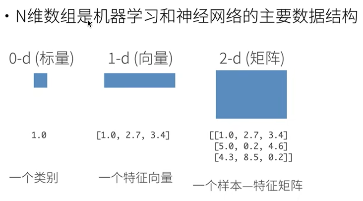

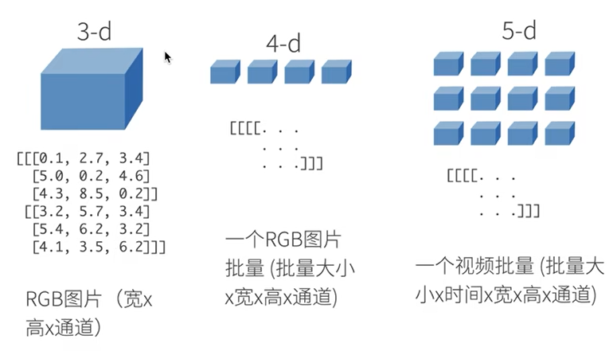


#### *访问元素

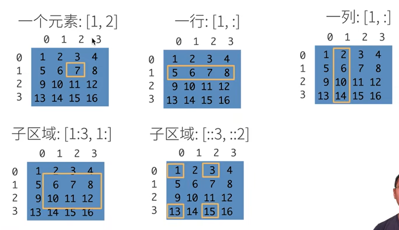

**上面列应为：[:, 1]	**  **子区域:[1:3, 1:] 其中是 [1,3)**  **[::3, ::2] 表示行每3一跳，列每2一跳**


### 数据操作实践

#### 张量相关操作

##### torch.arange()

```py
"""
torch.arange() - 张量表示一个数值组成的数组，这个数组可能有多个维度
tensor([ 0,  1,  2,  3,  4,  5,  6,  7,  8,  9, 10, 11])
"""
x = torch.arange(12)
print(x)
```


##### shape - 来访问张量的形状和张量中元素的总数

```py
"""
shape - 来访问张量的形状和张量中元素的总数
torch.Size([12])
12
"""
print(x.shape)
print(x.numel())
```


##### reshape  - 改变张量的形状而不改版元素数量和元素值

```py
"""
reshape(arg1, arg2) - 改变张量的形状而不改版元素数量和元素值
tensor([[ 0,  1,  2,  3],
        [ 4,  5,  6,  7],
        [ 8,  9, 10, 11]])
"""
x = x.reshape(3, 4)
print(x)
```


##### torch.zeros() - 创造全0、 全1、 或其他常量

```py
"""
zeros - 创造全0、 全1、 或其他常量
tensor([[[0., 0., 0., 0.],
         [0., 0., 0., 0.],
         [0., 0., 0., 0.]],

        [[0., 0., 0., 0.],
         [0., 0., 0., 0.],
         [0., 0., 0., 0.]]])
2:个数 
3、4决定张量的行列
"""
print(torch.zeros((2, 3, 4)))
```


##### torch.tensor（）- 提供包含数值的列表来为所需张量中的每个元素赋予确定值

```py
"""
tensor - 提供包含数值的列表来为所需张量中的每个元素赋予确定值
tensor([[2, 1, 4, 3],
        [1, 2, 3, 4]])
"""
temp = torch.tensor([[2, 1, 4, 3], [1, 2, 3, 4]])
print(temp)
```


##### 运算 

```py
"""
常见的运算可进行
tensor([ 3.,  4.,  6., 10.]) 
tensor([-1.,  0.,  2.,  6.])
tensor([ 2.,  4.,  8., 16.]) 
tensor([0.5000, 1.0000, 2.0000, 4.0000]) 
tensor([ 1.,  4., 16., 64.])
"""
x = torch.tensor([1.0, 2, 4, 8])
y = torch.tensor([2, 2, 2, 2])
print(x+y, x-y, x*y, x/y, x**y)
```


##### torch.cat((), dim) - 将多个张量连结在一起

```py
"""
torch.cat((arg1, arg2), dim=0) - 将多个张量连结在一起
tensor([[ 0.,  1.,  2.,  3.],
        [ 4.,  5.,  6.,  7.],
        [ 8.,  9., 10., 11.],
        [ 2.,  1.,  4.,  3.],
        [ 1.,  2.,  3.,  4.],
        [ 4.,  3.,  2.,  1.]])
tensor([[ 0.,  1.,  2.,  3.,  2.,  1.,  4.,  3.],
        [ 4.,  5.,  6.,  7.,  1.,  2.,  3.,  4.],
        [ 8.,  9., 10., 11.,  4.,  3.,  2.,  1.]])
dim = 2 就报错了：
print(torch.cat((X, Y), dim=2))
IndexError: Dimension out of range (expected to be in range of [-2, 1], but got 2)
"""
X = torch.arange(12, dtype=torch.float32).reshape((3, 4))
Y = torch.tensor([[2.0, 1, 4, 3], [1, 2, 3, 4], [4, 3, 2, 1]])
# print(torch.cat((X, Y), dim=0))
# print(torch.cat((X, Y), dim=1))
```


##### sum - 对张量中所有元素进行求和，会产生只有一个元素的张量

```py
"""
sum() - 对张量中所有元素进行求和，会产生只有一个元素的张量
tensor(66.)
"""
X = torch.arange(12, dtype=torch.float32).reshape((3, 4))
print(X.sum())
```


##### 形状不同，调用广播机制执行元素操作

```py
"""
形状不同，调用广播机制执行元素操作
a会复制成一个3x2的矩阵，b会复制成一个3x2的矩阵
tensor([[0],
        [1],
        [2]]) 
        
tensor([[0, 1]])

tensor([[0, 1],
        [1, 2],
        [2, 3]])
"""
a = torch.arange(3).reshape((3, 1))  # 维度(3,1)
b = torch.arange(2).reshape((1, 2))  # 维度(1,2)  这俩维度都是2
print(a, b)
print(a+b)
```


#### 元素的访问

##### 选最后一行元素

```py
"""
元素的访问 X行列都是0开始
X[-1] 选最后一行元素
tensor([ 8.,  9., 10., 11.]) 

X[1:3] [1,3) 
tensor([[ 4.,  5.,  6.,  7.],[ 8.,  9., 10., 11.]])
"""
X = torch.arange(12, dtype=torch.float32).reshape((3, 4))
print(X[-1], X[1:3])
```


##### 通过指定索引将元素写入矩阵

```py
"""
通过指定索引将元素写入矩阵
tensor([[ 0.,  1.,  2.,  3.],
        [ 4.,  5.,  9.,  7.],
        [ 8.,  9., 10., 11.]])
"""
X = torch.arange(12, dtype=torch.float32).reshape((3, 4))
X[1, 2] = 9
print(X)

```


##### 为多个元素赋值相同的值，需要索引所有元素，为他们赋值。

```py
"""
为多个元素赋值相同的值，需要索引所有元素，为他们赋值。
tensor([[12., 12., 12., 12.],
        [12., 12., 12., 12.],
        [ 8.,  9., 10., 11.]])
"""
X = torch.arange(12, dtype=torch.float32).reshape((3, 4))
X[0:2, :] = 12
print(X)
```


#### 高级运用中的内存问题

```py
"""
高级运用中的内存问题
1877036765408
1877036723072

避免：
使用这种 Z[:] = X + Y 或者 X += Y 来减少操作的内存开销
id(Z): 1588789461136
id(Z): 1588789461136
"""
before = id(Y)
print(before)
Y = Y + X
print(id(Y))

Z = torch.zeros_like(Y)
print('id(Z):', id(Z))
Z[:] = X + Y
print('id(Z):', id(Z))
```


#### 张量类型转换

##### 转换为NumPy张量 

```py
"""
转换为NumPy张量 
<class 'numpy.ndarray'>
<class 'torch.Tensor'>
"""
A = X.numpy()
B = torch.tensor(A)
print(type(A), type(B))
```

 

##### 将大小为1的张量转换为Python标量

```PY
import torch

"""
将大小为1的张量转换为Python标量
tensor([3.5000])
3.5
3.5 
3
"""
a = torch.tensor([3.5])
print(a, a.item(), float(a), int(a))
```


### 数据预处理

```py
import os
import pandas as pd
import torch

# 创建一个人工数据集，并存储在csv(逗号分隔值)文件
os.makedirs(os.path.join('..', 'data'), exist_ok=True)
data_file = os.path.join('..', 'data', 'house_tiny.csv')
with open(data_file, 'w') as f:
    f.write('NumRooms,Alley,Price\n')  # 列名
    f.write('NA,Pave,127500\n')  # 每行表示一个数据样本
    f.write('2,NA,106000\n')
    f.write('4,NA,178100\n')
    f.write('NA,NA,140000\n')

# 加载原始数据集
data = pd.read_csv(data_file)
# print(data)


"""处理缺失数据，插值或删除，此处选择插值
对于inputs中的类别值或离散值，可将NaN视为一个类别
"""
inputs, outputs = data.iloc[:, 0:2], data.iloc[:, 2]
inputs = inputs.fillna(inputs.mean())
# print(inputs)
inputs = pd.get_dummies(inputs, dummy_na=True)
# print(inputs)

# inputs outputs中所有条目都是数值类型，现状可以转换为张量格式
"""
tensor([[3., 1., 0.],
        [2., 0., 1.],
        [4., 0., 1.],
        [3., 0., 1.]], dtype=torch.float64)
        
    tensor([127500, 106000, 178100, 140000])
"""
X, y = torch.tensor(inputs.values), torch.tensor(outputs.values)
# print(X, y)

```


## 05 线性代数

### 线性代数

#### 通过指定两个分量m和n来创建一个m x n 的矩阵

```py
"""
通过指定两个分量m和n来创建一个m x n 的矩阵
矩阵A: 
tensor([[ 0,  1,  2,  3],
        [ 4,  5,  6,  7],
        [ 8,  9, 10, 11],
        [12, 13, 14, 15],
        [16, 17, 18, 19]])
        
矩阵A的转置: 
tensor([[ 0,  4,  8, 12, 16],
        [ 1,  5,  9, 13, 17],
        [ 2,  6, 10, 14, 18],
        [ 3,  7, 11, 15, 19]])
"""
A = torch.arange(20).reshape(5, 4)
print('矩阵A:', A)
print('矩阵A的转置:', A.T)
```


#### 对称矩阵转置等于自己

```py
"""
对称矩阵转置等于自己
tensor([[True, True, True],
        [True, True, True],
        [True, True, True]])
"""
B = torch.tensor([[1, 2, 3], [2, 0, 4], [3, 4, 5]])
# print(B == B.T)
```


#### 给定具有相同形状的任何两个张量，任何按元素二元运算的结果都将是相同形状的张量

```py
"""
给定具有相同形状的任何两个张量，任何按元素二元运算的结果都将是相同形状的张量
tensor([[ 0.,  1.,  2.,  3.],
        [ 4.,  5.,  6.,  7.],
        [ 8.,  9., 10., 11.],
        [12., 13., 14., 15.],
        [16., 17., 18., 19.]])
        
tensor([[ 0.,  2.,  4.,  6.],
        [ 8., 10., 12., 14.],
        [16., 18., 20., 22.],
        [24., 26., 28., 30.],
        [32., 34., 36., 38.]])
"""
A = torch.arange(20, dtype=torch.float32).reshape(5, 4)
B = A.clone()  # 通过分配新内存，将A的一个副本分配给B
print(A, A+B)
```


#### 两个矩阵的按元素乘法称为哈达玛积

```py
"""
两个矩阵的按元素乘法称为哈达玛积
tensor([[  0.,   1.,   4.,   9.],
        [ 16.,  25.,  36.,  49.],
        [ 64.,  81., 100., 121.],
        [144., 169., 196., 225.],
        [256., 289., 324., 361.]])
        
tensor([[[ 2,  3,  4,  5],
         [ 6,  7,  8,  9],
         [10, 11, 12, 13]],

        [[14, 15, 16, 17],
         [18, 19, 20, 21],
         [22, 23, 24, 25]]]) 
torch.Size([2, 3, 4])
"""
print(A * B)

a = 2
X = torch.arange(24).reshape(2, 3, 4)
print(a+X, (a*X).shape)
```


#### sum - 指定求和汇总张量的轴

```py
"""
sum - 指定求和汇总张量的轴

单个维度：
tensor([40., 45., 50., 55.])
torch.Size([4])

2个维度：
print(A.sum(axis=[0, 1]).shape)
"""
A_sum_axis0 = A.sum(axis=0)
print(A_sum_axis0, A_sum_axis0.shape)
```


#### 计算总和或均值时保持轴数不变-才能用广播机制做除法

```py
"""
计算总和或均值时保持轴数不变-才能用广播机制做除法
tensor([[ 6.],
        [22.],
        [38.],
        [54.],
        [70.]]) 
        
tensor([[0.0000, 0.1667, 0.3333, 0.5000],
        [0.1818, 0.2273, 0.2727, 0.3182],
        [0.2105, 0.2368, 0.2632, 0.2895],
        [0.2222, 0.2407, 0.2593, 0.2778],
        [0.2286, 0.2429, 0.2571, 0.2714]])
"""
sum_A = A.sum(axis=1, keepdims=True)
print(sum_A, A/sum_A)
```


#### cumsum(axis) - 某个轴计算A元素的累计总和

```py
"""
cumsum(axis) - 某个轴计算A元素的累计总和

tensor([[ 0.,  1.,  2.,  3.],
        [ 4.,  6.,  8., 10.],
        [12., 15., 18., 21.],
        [24., 28., 32., 36.],
        [40., 45., 50., 55.]])
"""
A.cumsum(axis=0)
print(A.cumsum(axis=0))
```


#### dot - 点积是相同位置的按元素乘积的和

```py
"""
dot - 点积是相同位置的按元素乘积的和
也可以通过按元素乘法，进行求和来表示两个向量的点积

tensor([1., 1., 1., 1.]) 
tensor([1., 1., 1., 1.]) 
tensor(4.)
元素乘法实现2个向量点积： tensor(4.)
"""
y = torch.ones(4, dtype=torch.float32)
x = y
print(x, y, torch.dot(x, y))
print('元素乘法实现2个向量点积：', torch.sum(x*y))
```


#### mm - 执行m次矩阵向量积，形成n x m矩阵

```py
"""
mm - 执行m次矩阵向量积，形成n x m矩阵
tensor([[ 6.,  6.,  6.],
        [22., 22., 22.],
        [38., 38., 38.],
        [54., 54., 54.],
        [70., 70., 70.]])
"""
B = torch.ones(4, 3)
print(torch.mm(A, B))
```


#### norm - L2范数,向量元素平方和的平方根

```py
"""
u - L2范数,向量元素平方和的平方根
tensor(5.)
"""
u = torch.tensor([3.0, -4.0])
print(torch.norm(u))
```


### 矩阵计算

#### 截图笔记

**这部分不理解可以去找 矩阵求导本质视频学习**

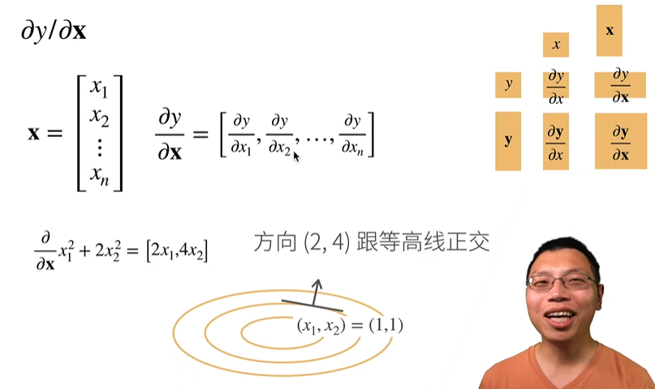

**梯度指向变化最大的方向**


**X是向量**

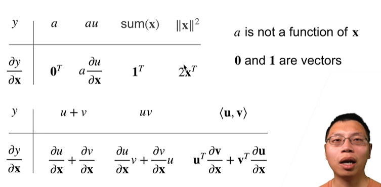


**y是向量**

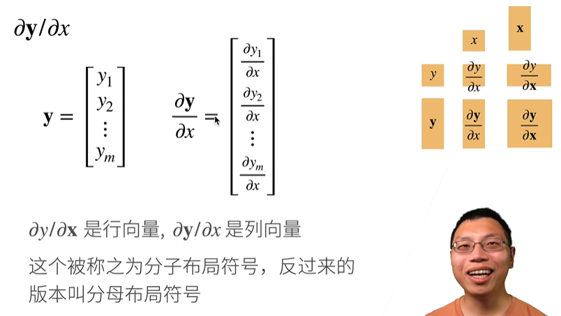


**x，y都是向量**

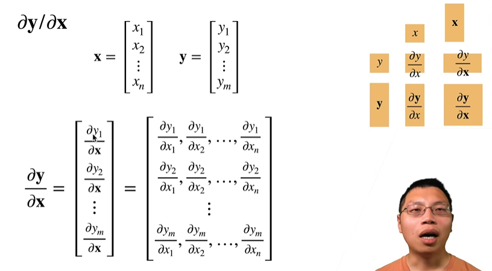


## 07 自动求导

### 向量链式法则

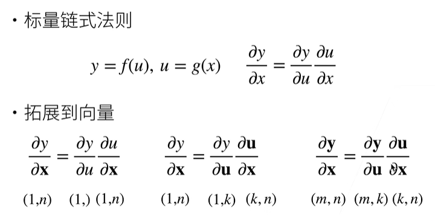

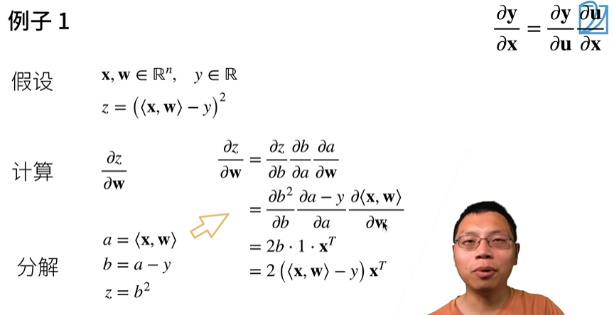


**自动求导**

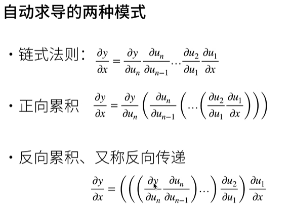


#### 反向积累

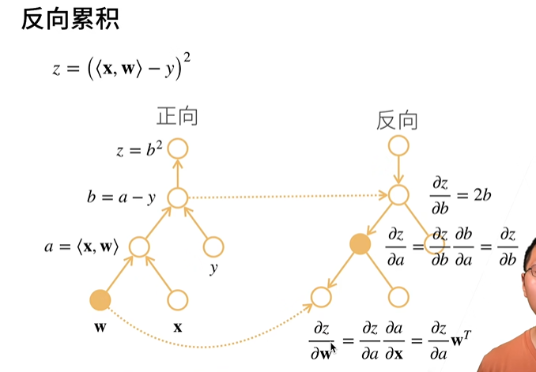

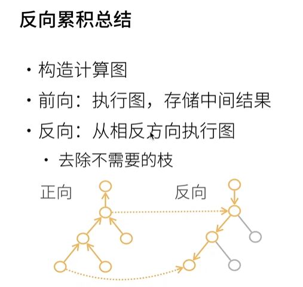


### 自动求导实现

#### 例子1 - y=x(T)x  关于列向量x求导

```py
import torch

x = torch.arange(4.0)
print(x)  # tensor([0., 1., 2., 3.])

# 在计算y关于向量x的梯度之前，需要存储梯度
x.requires_grad_(True)
print(x.grad)  # None

# 计算y
y = 2 * torch.dot(x, x)
print(y)  # tensor(28., grad_fn=<MulBackward0>)

# 通过调用反向传播函数来自动计算y关于x每个分量的梯度
y.backward()
print(x.grad)  # tensor([ 0.,  4.,  8., 12.])
print(x.grad == 4 * x)  # tensor([ 0.,  4.,  8., 12.])


```


#### 例子2 -  y = x.sum()

```py
# 在默认情况下，PyTorch会积累梯度，需要清除之前的值
x.grad.zero_()
y = x.sum()
y.backward()
print(x.grad)  # tensor([1., 1., 1., 1.])

```

 

#### 例子3 - y=x*x

```py
# 深度学习中，目的不是计算微分矩阵，而是批量中每个样本单独计算的偏导数之和
x.grad.zero_()
y = x * x
y.sum().backward()
print(x.grad)  # tensor([0., 2., 4., 6.])
```


## 08 线性回归

#### 理论建立模型

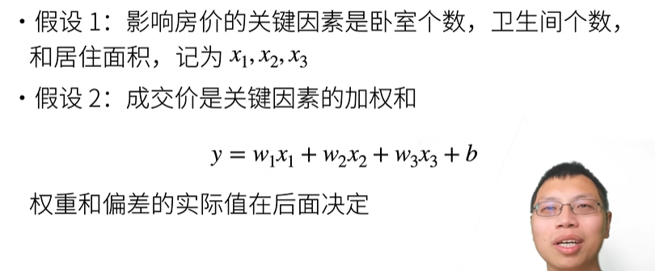

##### 转为线性模型

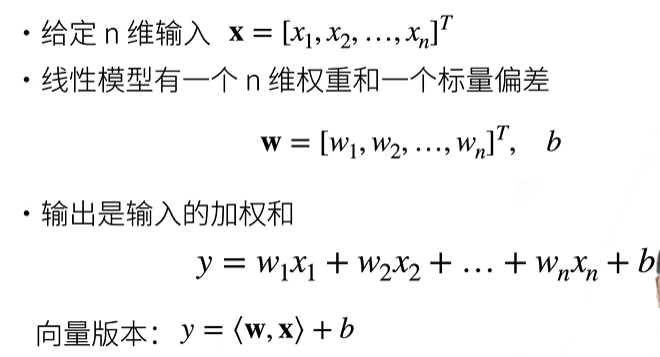


##### 衡量预估质量

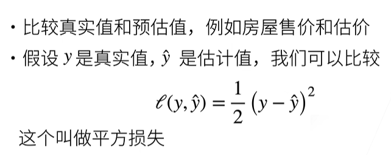


##### 训练数据

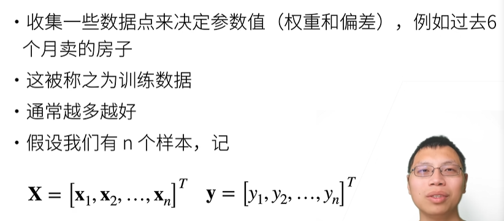


##### 参数学习

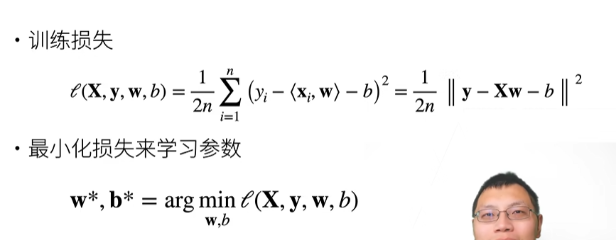


##### 显示解

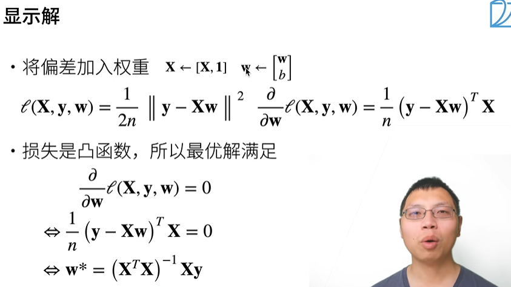

尾部公式应为以下：
$$
P = X^TX
$$

$$
w* = P^-1 X^Ty
$$


#### 线性回归总结

- 线性回归是对n维输入的加权，外加偏差
- 使用平方损失来衡量预测值和真实值的差异
- 线性回归有显示解
- 线性回归可以看作是单层神经网络


### 基础优化方法

#### 梯度下降

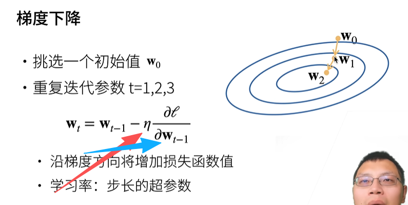

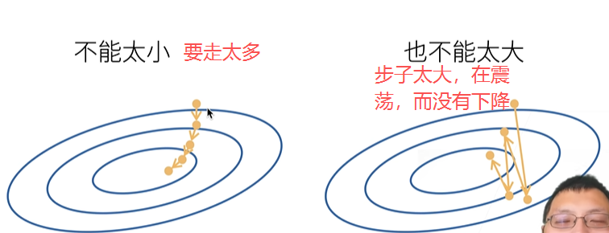


**小批量随机梯度下降**

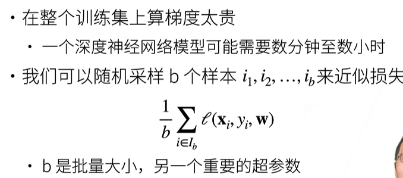

批量太小：不适合并行来最大利用计算资源

批量太大：内存消耗增加，浪费


#### 总结

- 不断沿着反梯度方向更新参数求解
- 小批量随机梯度下降是深度学习默认的求解方法
- 超参数批量大小和学习率很重要


### 线性回归的从0开始实现

```py
# 此处需要更新 否则引入包的时候会报错
pip install -U d2l
```

```py
# 从0实现整个方法，包括数据流水线、模型、损失函数、小批量随机梯度下降优化器
import random
import torch
import matplotlib as plt
from d2l import torch as d2l

"""
根据带有噪声的线性模型构造一个人造数据集。
使用线性参数
w = (2,-3.4)^T  b=4.2和噪声e生成数据集及标签
y = Xw + b + e

"""


def synthetic_data(w, b, num_examples):
    """生成 y = Xw + b + 噪声"""
    x = torch.normal(0, 1, (num_examples, len(w)))
    y = torch.matmul(x, w) + b
    y += torch.normal(0, 0.01, y.shape)
    return x, y.reshape((-1, 1))


true_w = torch.tensor([2, -3.4])
true_b = 4.2
features, labels = synthetic_data(true_w, true_b, 1000)
# print('features:', features[0], '\nlabels:', labels[0])
# features: tensor([-0.5487,  0.4418])
# labels: tensor([1.5962])

# 第一列和label作为x、y轴画图
d2l.plt.scatter(features[:, 1].detach().numpy(),
                labels.detach().numpy(), 1)
# d2l.plt.show()


# 小批量随机
def data_iter(batch_size, features, labels):
    """
    :param batch_size: 最后生成的大小为batch_size的小批量
    :param features: 特征矩阵
    :param labels: 标签向量
    """
    num_examples = len(features)
    indices = list(range(num_examples))  # 每个样本的index列表
    # 随机读取样本
    random.shuffle(indices)
    for i in range(0, num_examples, batch_size):
        # 防止越界
        batch_indices = torch.tensor(
            indices[i:min(i + batch_size, num_examples)])
        # 产生随机顺序的特征以及随机顺序的标签
        # yield 不断的调用不断的返回直到结束。
        yield features[batch_indices], labels[batch_indices]


# 验证小批量随机方式
batch_size = 10
for X, y in data_iter(batch_size, features, labels):
    # print(X, '\n', y)
    break

# 定义初始化模型参数 均值0 方差0.01
w = torch.normal(0, 0.01, size=(2, 1), requires_grad=True)
b = torch.zeros(1, requires_grad=True)


# 定义模型
def linreg(X, w, b):
    """线性回归模型"""
    return torch.matmul(X, w) + b


# 定义损失函数
def squared_loss(y_hat, y):
    """均方损失"""
    # 把y reshape为 y_hat 的 shape
    return (y_hat - y.reshape(y_hat.shape))**2 / 2


# 定义优化算法
def sgd(params, lr, batch_size):
    """小批量随机梯度下降"""
    with torch.no_grad():
        for param in params:
            param -= lr * param.grad / batch_size
            param.grad.zero_()  # 手动梯度设0


# 训练过程
lr = 0.03
num_epochs = 3
net = linreg
loss = squared_loss

for epoch in range(num_epochs):
    for X, y in data_iter(batch_size, features, labels):
        """
        'X'和'y'的小批量损失
        l形状为 ('batch_size', l)
        """
        l = loss(net(X, w, b), y)
        l.sum().backward()  # 算梯度
        sgd([w, b], lr, batch_size)  # 使用参数的梯度更新参加
    with torch.no_grad():
        train_l = loss(net(features, w, b), labels)
        print(f"epoch{epoch + 1}, loss {float(train_l.mean()):f}")

print(f'w的估计误差：{true_w - w.reshape(true_w.shape)}')
print(f'b的估计误差：{true_b - b}')


```


### 线性回归的简洁实现

```py
# 问题 jupyter notebook无法切换python内核

python -m ipykernel install --user --name py39 --display-name "Python 3.9"
```

**笔记部分在jupyter notebook store**


### Q&A

1. detach（）作用

   似乎是，告诉他不需要求梯度了

2. 使用的data-liter写法每次输入load，数据多内存会爆，有办法解决吗？

   是的，但是目前使用的数据不多，还可以这样用。

3. indices为什么要转化成tensor，直接用列表可以吗？

4. 如果样本大小不是批量数的整数倍，需要随机提出多余样本吗？

   调小batch-size 或从下一个epoch取够


## 09 Softmax 回归 + 损失函数 + 图片分类数据集

### 1 Softmax 回归

回归估计一个连续值，分类预测一个离散类别

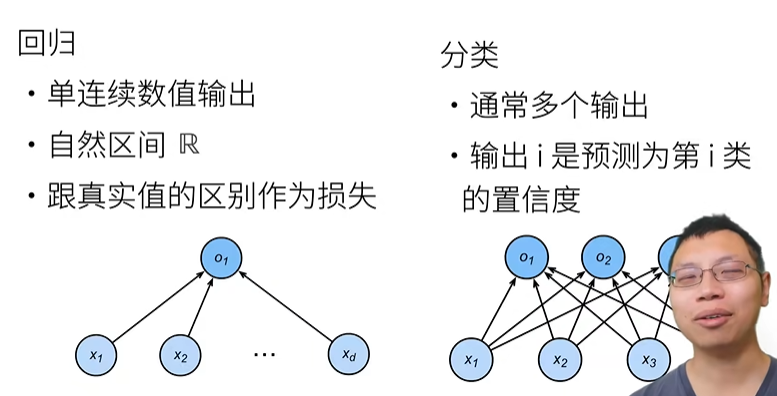

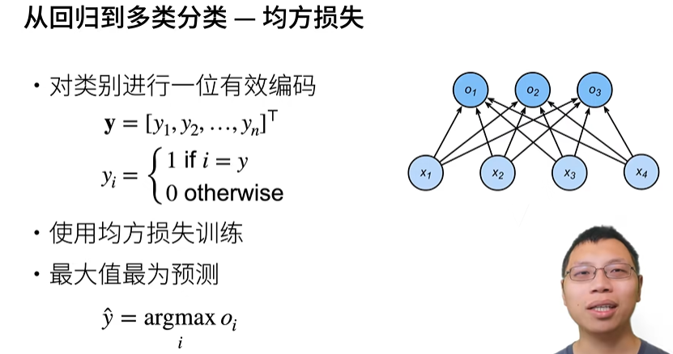

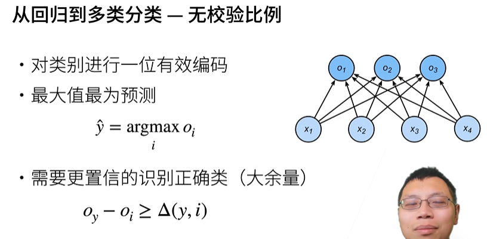

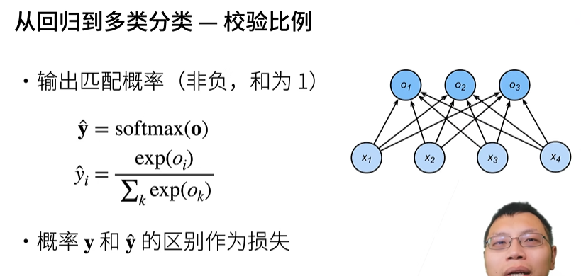

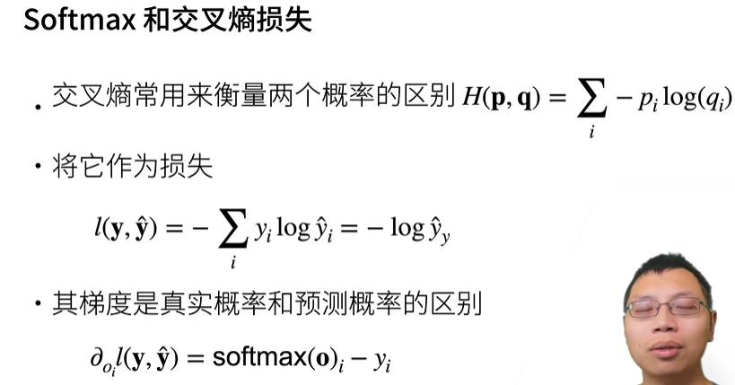

**Softmax 回归是一个多类分类模型。使用 Softmax 操作得到每个类的预测置信度。 使用交叉熵来衡量预测和标号的区别  **


### 2 损失函数

**均方损失**

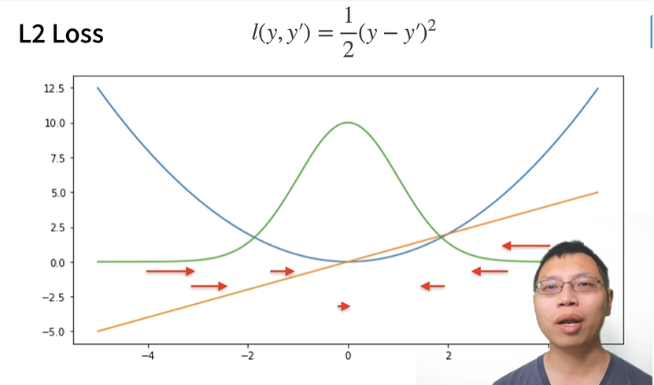

**绝对值损失函数**

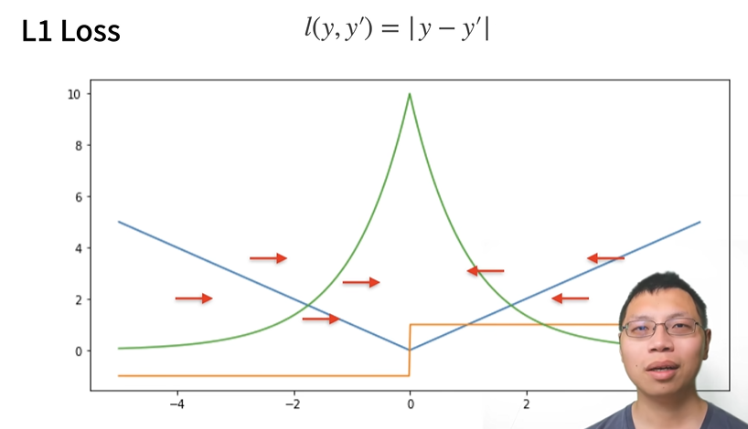

缺点：0点处不可导，某些点变化剧烈


**鲁棒损失**

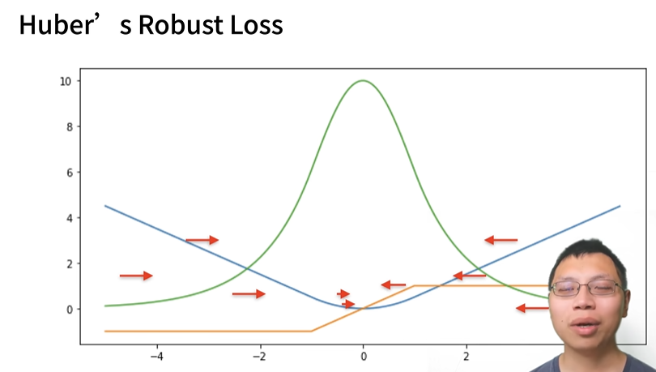


### 3 softmax解释

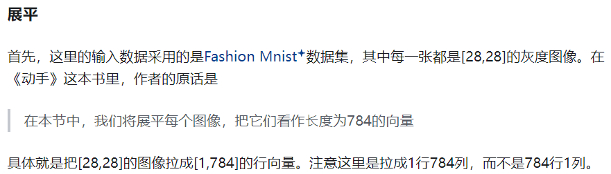

**Softmax操作**

简短版本是：求幂 -> 求和 -> 归一化

复杂版本：

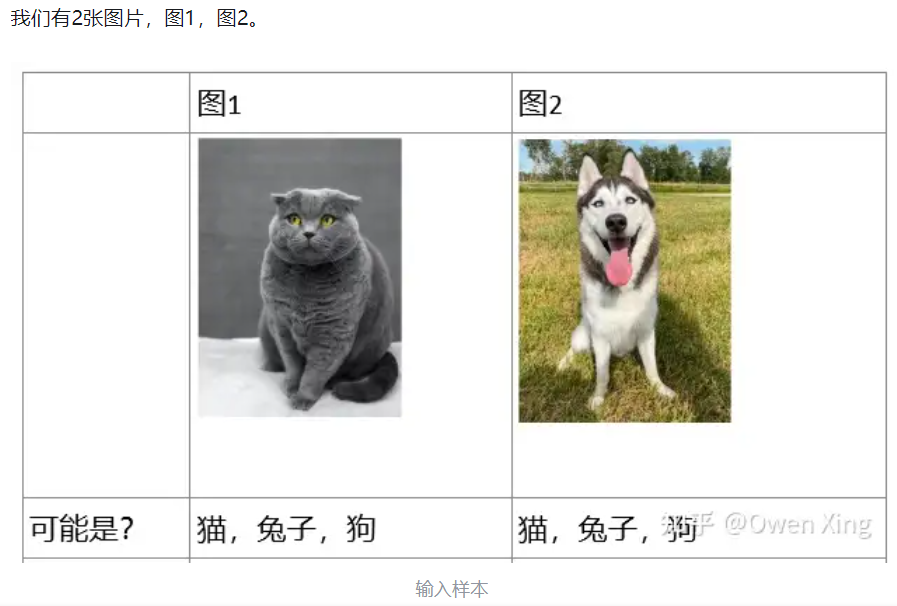

我们希望使用softmax回归，来告诉我们这张图片是猫，是狗，还是兔子。经过一定的运算，得到了这样的结果

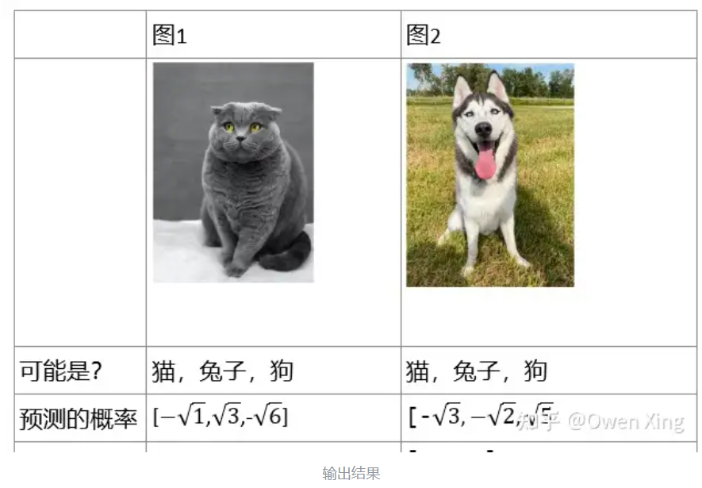

首先是要把计算的结果变成非负数，并且加起来等于1。所以我们首先**求幂**（假设求平方）。然后求和。然后归一化（和为1）

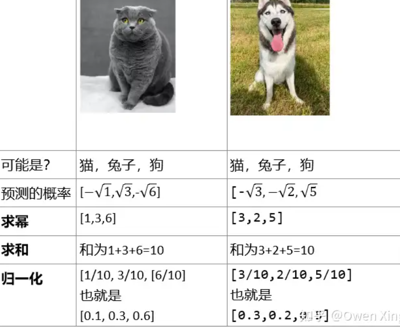

Softmax操作：求幂，求和，归一化

根据【猫，兔子，狗】的预测顺序，得到以下

```
tensor y = torch.tensor([0,2])
```

这个tensor内的数字表示的是它属于的class的index。0表示【猫，兔子，狗】这个list的index=0的动物，就是猫。2表示【猫，兔子，狗】这个list的index=2的动物，就是狗。

```
y_hat = torch.tensor([[0.1, 0.3, 0.6], [0.3, 0.2, 0.5]])
```


**交叉熵**

yhat行数为2，表示总共预测了2张图片。yhat列数为3。

对于第一张图片来说（顺序为【猫，兔子，狗】），机器预测的结果分别表示是猫的概率为0.1，兔子的概率为0.3，狗的概率为0.6。

对于第二张图片来说，机器预测的结果分别表示是猫的概率为0.3，兔子的概率为0.2，狗的概率为0.5

取概率最大的那个来表示机器的预测结果。所以，机器认为，第一张图是狗，第二张图片也是狗。

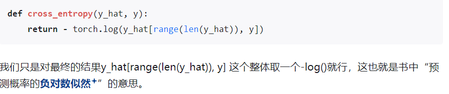


**对于yhat中的每一行，也就是每一张图片，找到它的最大值，并且用它的Index来表示。所以y_hat就可以表示为tensor([2,2])**

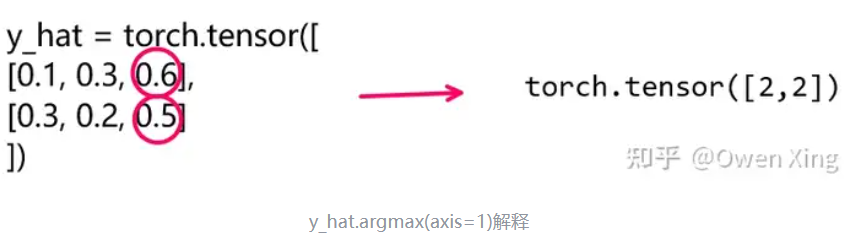

比较y_hat和y是否在每一个位置上的值相等。

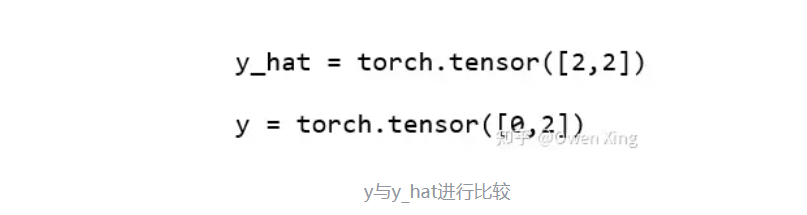

第一个位置不等，第二个位置相等，也就是说第一张图片预测错误，第二章图片预测正确。


## 10 多层感知机 + 代码

### 感知机

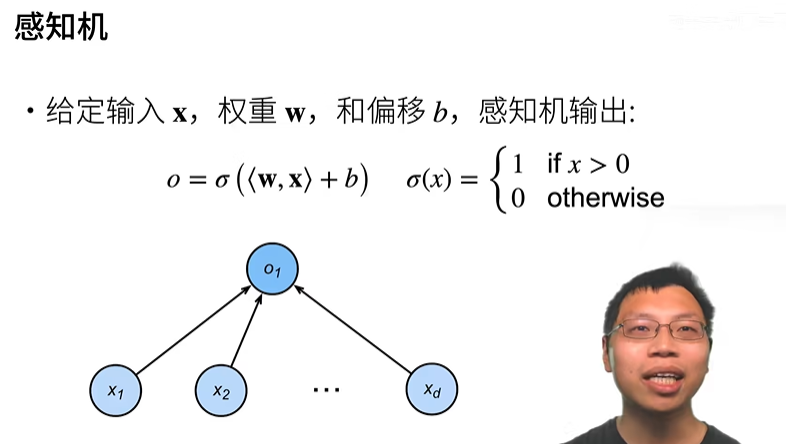

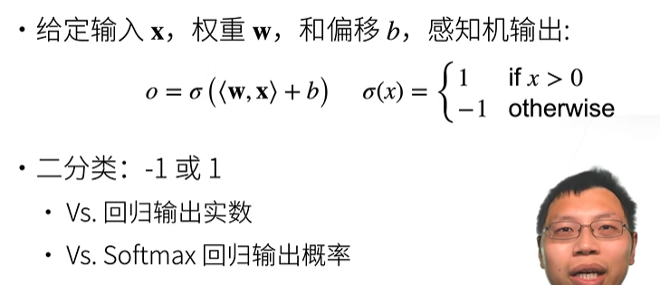


**训练感知机**

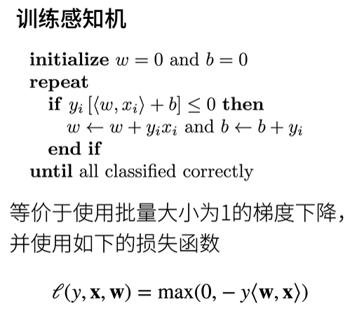


**收敛定理**

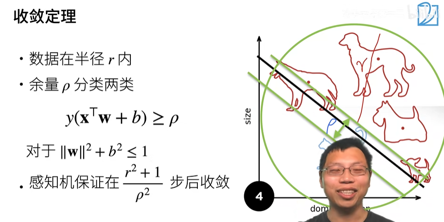


**XOR问题**

怎么分都没办法分对

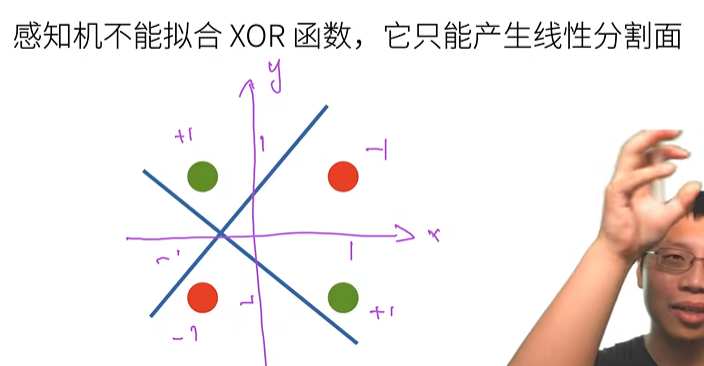


### 多层感知机

**学习XOR**

蓝色的线 橘色的线都会有个分类，两个综合起来就是最后的product

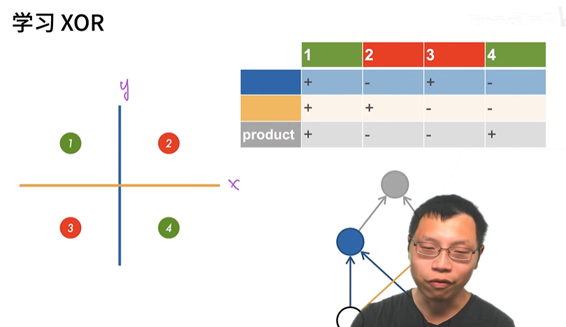

**单隐藏层**

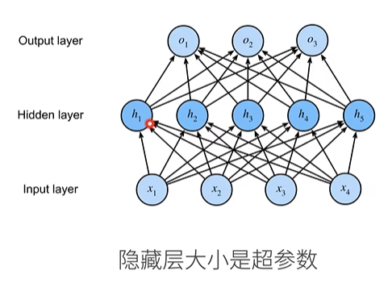

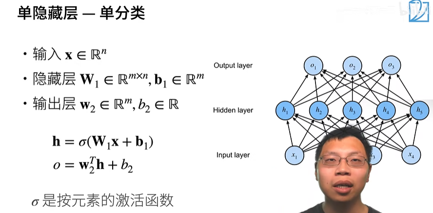

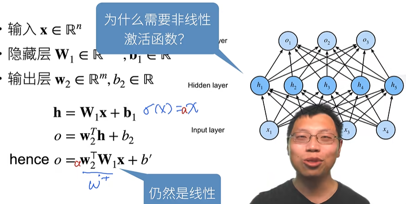

**激活函数**

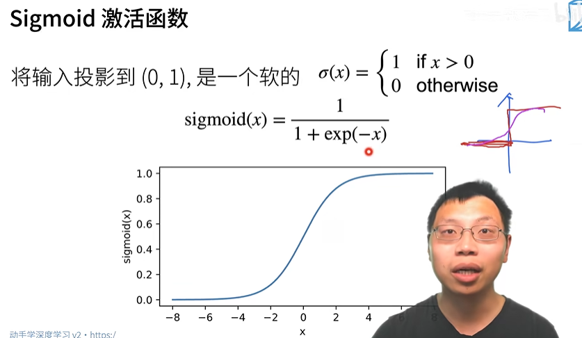

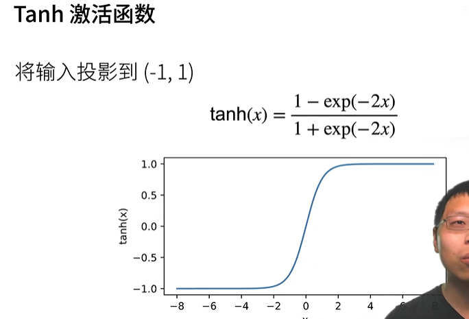

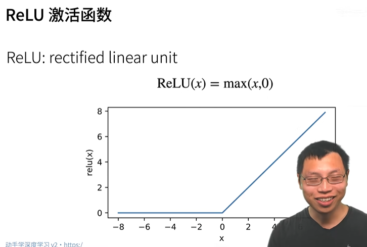


**多类分类**

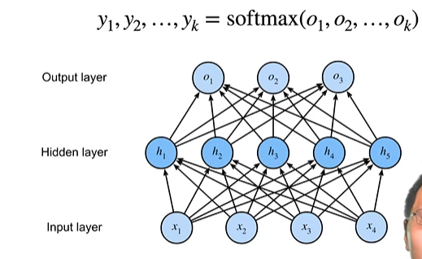

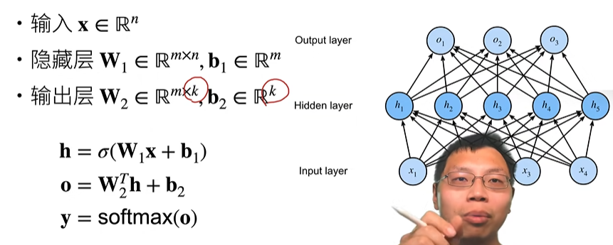


## 11  过拟合和欠拟合

### 过拟合和欠拟合


**模型容量**


**模型容量的影响**


**估计模型容量**

- 参数的个数
- 参数值的选择范围


**数据复杂度**

- 样本个数
- 每个样本的元素个数
- 时间、空间结构
- 多样性

### 代码

以此为例


## 12 权重衰退


**拉格朗日乘子法**


中心是最优点，绿线是等高线


w这部分就是这个黄圆


当中心点向外，l会变大，但损失会变小。但l和损失的关系，和这个函数的变化有关。


平衡点


**参数更新法则**


η是学习率   每次更新会自己先把wt做一次放小，这就是权重衰退


**总结**

- 权重衰退通过 L2 正则项使得模型参数不会过大，从而控制模型复杂度
- 正则项权重是控制模型复杂度的超参数


## 13 丢弃法

**动机**


- 不管加入多少噪音，图片中的内容始终都是能够看清除的
- 正则项的作用就是使得权重不要过大，避免过拟合
- 在数据中加入噪音等价于一个正则
- 丢弃法是在层之间加入噪音，丢弃法其实是一个正则


**无偏差的加入噪音**


- 假设x是上一层到下一层的输出，对x加入噪音，但是不要改变它的期望
- 丢弃法：对于x’，给定一个概率p，在p的概率中将真是的原始的输入变成0，在其它的地方除以一个（1-p），即将该输入变大。在一部份地方以一定的概率p变成0，在另外一部分地方以一定的概率变大，所以它的期望是不变的


**使用丢弃法**


- h是第一个隐藏层的输出，dropout表示对h使用丢弃法


**推理中的丢弃法**


- 正则项只在训练中使用，它只会对权重产生影响，在预测的时候，权重不需要发生变化的情况下，不需要正则，所以在推理中不需要正则，确保在推理过程中能够有一个确定性的输出
- 在预测的过程中因为不训练，所以不使用dropout
- 2021年仍然类似是 炼丹


**总结**


- 常用在多层感知机的隐藏层输出上，就是对应的全连接层的额隐藏层输出上，很少会用在CNN这类的模型上面

可以模型复杂一点，使用dropout再丢一部分


## 14 数值稳定性 + 模型初始化和激活函数  这部分全公式，后面需要再看

### 数值稳定性

**神经网络的梯度**


**数值稳定性的两个问题：梯度爆炸、梯度消失**


**以MLP为例**


- t是层 T是转置

  

  因为其他部分全都变成0 或者1 ，其值就和后半部分相关。

  **梯度爆炸的问题**

  

  **梯度消失**

  

  **梯度消失的问题**

  

### 模型初始化


- $$
  E[h^t_i]是个标量
  $$


**权重初始化**


**以MLP为例**


- $$
  W^t_i,是第t层第i行第i列的权重。E是期望，Var是方差
  $$

- $$
  h^t是第t层的输入
  $$

**正向方差**


**反向均值和方差**


## 15 实战：kaggle房价预测 ＋ 课程竞赛

**需要把无关的属性去掉，需要先处理**


### QA

1. 避免overfit 

   需要调参，需要一个好的验证集。在实际中调参没有太重要。打比赛可用集成学习，但是运气可能是。

2. 改进模型不占主要时间。首先是数据，再是模型


## 15.1 vscode链接云服务器的问题

**上传配置**

```py
# 放桌面
pip freeze > C:\Users\Lenovo\Desktop\requirements.txt
```

- 本地导出 指令如上

- 无卡开机 上传代码、数据集、requirements.txt到/root/autodl-tmp

- ```py
  # 实例终端执行
  conda create -n d2l python=3.8 -y
  conda activate d2l
  pip install -r /root/autodl-tmp/requirements.txt
  ```

  

把 requirements.txt 上传到 /root/autodl-tmp/


```py
数据太大就需要更改其中的一些方法了
所以先不继续，大体就是那样的流程，可以继续往下

到后面再去集中研究怎么把这个代码转为 使用gpu的
```


# 16-30

## 16 PyTorch 神经网络基础

1. 类别变量转换为伪变量的时候内存炸掉了怎么办（就是那个竞赛，独热编码的时候直接爆了的问题）

   解法1：使用稀疏矩阵

   解法2：不用独热编码，用别的。只把词拿出来（其实没听懂，往后看）


## 17 使用和购买GPU


## 19 卷积层

### 从全连接到卷积

- **分类猫和狗的图片**

  

  - 假设用手机拍摄了一张1200万像素的照片，而且是RGB图片，有R、G、B三个通道（channel），也就是有3600万个像素，每个像素对应有一个值
  - 假设用一个单隐藏层的MLP来进行训练，隐藏层的大小是100，那么这个模型就有36亿个参数，这个数量远多于世界上所有的猫和狗的总数，还不如将所有的猫和狗全部记下来
  - 所以这就是当使用MLP，特别是比较大的图片的时候所遇到的问题

- **两个原则**

  

  - 所以这就是当使用MLP，特别是比较大的图片的时候所遇到的问题
  - 局部性：只需要看到局部的信息就可以了，而不需要看到全局的信息

- 

  - 之前的全连接层的输入输出是一维的向量，这里为什么又还原成了矩阵？因为要考虑空间的信息，所以将输入和输出变成矩阵，它有宽度和高度这两个维度

  - 对应的可以将权重变成一个4维的张量，之前是输入的长度到输出的长度的变化，现在变成了输入的高宽到输出的高宽的变化，所以可以将它reshape成为一个4D的张量

  - 加了高和宽两个维度，变成了4维。

     i  j  对应的是 输出的值 在输出矩阵上的位置。k l 对应的是输入的值在输入矩阵的位置。 由此抽象成一个4维的张量。

    **权重** 之前的权重之所以是2维的张量，是因为之前的输入输出都是1维的向量。第1维表示输出向量的位置，第2维表示输入向量的位置。而现在，输出输出都变成了2维向量，权重也变成了4维的张量

  - 

    向量i 到目标j ，需要一个 ixj 的矩阵

    同理。后面的 需要一个 四维的矩阵或者张量，才能完成到kl的映射

    

- **从卷积理解**

  - 图像处理中的卷积核

    其实无论是叫卷积还是滤波(filter)都无所谓了，反正都是一个东西。

    大家都是知道图像都是由像素点组成的，而每个像素点都有一个对应的像素值，根据值的不同，表现出不同的颜色。比如我们这里可以虚拟一个图像。

    

    进行卷积操作，我们还需要另外的一个变量，这里我们虚拟另外一个卷积核

    

    前者是一个5×6的矩阵，而后者是一个3×3的矩阵。我们是很难去直接计算的。所以这里有些小tips！我们只需要依次从大的图像中采样一个和我们的核一样大的图形，就可以进行卷积操作了。

    

    然后也就可以将这个红框中的数据与我们最初的卷积核进行计算

    

    这就是我们口中的离散卷积(求0位置处的值罢了，刚好就是对称的)。这样就求到了第一个值，那么我们再滑动卷积核，继续以这样的方式去计算第二个滑块。

    

- **原则1：平移不变性**

  

  联系卷积 卷积核不依赖于当前图片的位置(i, j)仅取决于自己。具有**平移不变性**。

- **原则2：局部性**

  

  卷积运行仅取决于当时的图像位置(卷积核大小)，具有**局部性**。

- **总结**

  

  - 所以说卷积是一个特殊的全连接层
  - 将a和b限制在一个很小的值


### 卷积层

- **二维交叉相关(二维卷积)**

  

  

- **二维卷积层**

  

  **例子**

  

  

- **交叉相关 vs 卷积**

  

  - 交叉相关和卷积是没有太多区别的，唯一的区别是在卷积上a、b的值有负号
  - 卷积在索引W的时候是反过来走的，但是因为它是对称的，所以在实际使用的时候没有任何区别，神经网络为了方便，所以没有使用数学上严格定义的卷积，严格定义的话应该是要反过来的

- **一维和三维交叉相关**

  

  

- **总结**

  

  - 超参数就是卷积核的大小，卷积核的大小控制了局部性，卷积核越大看到的范围越广，卷积核越小看到的范围也就越小
  - 卷积层可以看成一个特殊的全连接层
  - **卷积解决了权重参数随着输入规模的增大而增大的问题，通过不变性减小了权重参数的数量**


## 20 卷积层里的填充和步幅

**填充**


- 第一层为什么得到的输出是28*28？

  这里的步长应该是默认为1，到最右边的时候会剩下四列元素不能全部被5*5的卷积核看到（因为这里没有用池化），所以卷积核在横向移动的过程中走了28步之后，就不能再往右边走了

  因为再往右边走的话，卷积核的所覆盖的部分列就没有输入的，这里由于没有采取池化操作，因此输入最右边的4列就被舍弃掉了，因为只走了28步，所以最后输出就是28*28了（高宽同理）

- 第七层得到的输出为什么是4*4？

  第一层卷积得到28*28的输出可知，每做一次卷积操作就会舍去4个输出，所以做完7次卷积之后输出的大小为（32-4*7）*（32-4*7）= 4*4

- 更大的卷积核可以更快地减小输出的大小


- 填充就是在输入的四周加入一些额外的行和列，这样可以使的通过卷积层之后的输出变得比之前更大一些
- 上图的输入中中间3*3的矩阵是原始的输入，在它的上下左右分别填充了一些零，填充之后再做卷积会发现输出会由2*2变成4*4，也就是说输出比输入还要大（多出了一行一列）


- p表示padding

- 通常会填充卷积核的高宽减一的值，这样做的好处是输出和输入的形状不会发生变化（将其代入上图中的第一个公式就能得到）

  这样的话，不管选取多大的卷积核，都不会改变输出的形状

- 具体在填充的时候如果卷积核的大小是奇数的话，就在输入的上下两侧填充，当卷积核的大小为偶数的时候（卷积核的大小很少选取为偶数），在输入的上侧会多填一行，下侧会少填一行（反过来其实也可以，但是一般也差不多）


- 假设输入比较大的话需要进行大量的计算
- 上图中应该是需要55层才能将输入降低到4*4，因为每做一次卷积操作输出的大小减少4，所以需要55次卷积操作才能将输出降低到4*4
- 输出大小是跟卷积层的层数线性相关的，步幅可以将其变成指数相关


- 步幅指的滑动窗口在行/列上移动的步长，也就是往右走多少列，往下走多少行

- 具体的计算如下图所示

  

- 行（8-3+0+3）/3 =2
- 列（8-5+1*2+4）/4=2
- kernel_size=(3,5)

**总结**


- 填充是让输出不变或者是变大
- 当输入的大小很大的时候，可以通过控制步幅来减少计算量
-  （X.shape - kernel_size + padding*2 ）/stride +1


## 21 卷积层里的多输入多输出通道

### 多输入多输出通道

**多输入多输出通道的卷积过程**：

**输入通道数等于卷积核通道数，卷积核数等于输出通道数。**

一个卷积核可以有多个通道，通道数等于输入图像的通道数，例如图中和李沐老师例子中RGB三色的3通道，一个卷积核就有3通道。


而一个多通道的卷积核将会逐通道与对应的输入层的通道做卷积，最后再加起来就得到了单通道的输出，如图中的56的得来过程。


**而有时候图像识别可能需要识别多个特征或者不同的信息，就需要多个卷积核，每个卷积核（n个卷积核）分别与输入图像做卷积就得到多个（n个输出通道）输出通道。**


- 一张彩色图片是由红绿蓝三个通道组成的，所以图片在表示的时候通道数是3


- 每一个通道都有对应的卷积核
- 每个通道的输入和对应通道的卷积核做卷积，然后将得到的各个通道上的输出进行叠加（对应位置上的元素相加）得到最终的结果
- 
  - 输出是单通道的，不管输入有多少个通道，输出是他们输出结果的叠加，所以始终是单通道
- 
  - 如果对每一个输出通道有一个三维的卷积核，这个卷积核会输出自己的通道（就相当于在三维的基础上又加了一维 i ，这一维表示输出的通道数）
  - 这里输入和输出通道是没有相关性的
- 


- 卷积核的高和宽都等于1，意味着它不会识别空间信息，因为他每次只看一个空间像素所以不会去识别通道中的空间信息
- 输出的值等价于将对应的输入位置上的不同通道上的值做加权和

- 1 * 1 卷积核的作用就是去融合不同通道的信息可以认为是不做空间的匹配，只是在输入层直接做输入通道和输出通道的融合，等价于将整个输入拉成一个向量，通道数等于feature的数量，卷积核相当于一个co*ci的全部连接层
- 1*1的卷积层就等价于一个全连接层，不做任何的控制信息，因为全连接层不考虑空间信息它**只考虑在特征维度（也就是输入通道维数）的融合**
- 它是一个特殊的卷积层


 **总结**


## 22 池化层


- x最左边第二列和第三列中间有一个边缘，如果用一个1*2的卷积核（一边是1，一边是-1），就会在输出的第二列全部为1，也就意味着将边缘全部检测出来了，但是这一列的左边是0右边也是0，也就是说它对位置是非常敏感的，一个像素的偏移就会导致0输出
- 所以这不是一件特别好的事情，因为边缘在真实图片中很有可能不是很规矩，可能会有弯曲的地方，而且相机的抖动或者物体的移动都会导致边缘发生变化，所以需要一定的平移不变性（输入稍微有一点改动，输出不会有太大的变化，减低卷积核对位置的敏感程度）


- 工作原理和卷积有点类似，有一个窗口在输入上滑动，得到输出
- 但是这里的操作不是像卷积核一样让卷积核和输入做点积然后加起来，而是每一次将滑动窗口中的最大值取出来作为输出值（最大池化）
- 简单来讲就是用滑动窗口来计算输出，但是每一次不用核做计算，而是将滑动窗口中的最大值输出


- 目的是要做垂直边缘检测，最左边的矩阵是输入，中间的矩阵是卷积输出，如果在卷积输出的基础上再做一次2*2的最大池化可以得到最右边的矩阵（上图中最右边的矩阵多了一列1）
- 上图中可以发现2*2得最大池化层可以容忍最大1个像素的偏移
- 最大池化层可以允许输入发生一定程度上的小偏移，而且作用在卷积输出上，可以增加一点模糊化的效果


- 填充和步幅是和卷积类似的两个超参数
- 池化没有可以学习的参数，它不需要学习核里面的参数，因为他就是一个取最大值的操作
- 池化层作用于多输入通道的输入的时候，对每一个输入通道都做一次池化层的操作得到对应的输出通道，而不像卷积一样可以融合多个通道，池化是不会融合多个通道的，他是每一个通道做一次池化层，也就意味着输出的通道数是等于输入通道数的，相对来说比较简单
- 池化操作为什么不做多通道的融合？因为多通道融合可以交给卷积来进行，就可以将池化层做的相对比较简单


- 另外一个常用的池化层，就是将最大池化层中取最大值的操作变成求平均值的操作
- 最大池化层和平均池化层的区别：最大池化层输出的是每个窗口中最强的信号，平均池化层输出的是每个窗口中平均的信号强度


**总结**


## 23 经典卷积神经网络 LeNet


```py
# 本结内容采用gpu，所以在此更换环境为gpu
python 3.8版本
# 装gpu版 可以问ai去找对应的版本
pip install torch==1.12.0+cu116 torchvision==0.13.0+cu116 torchaudio==0.12.0 --extra-index-url https://download.pytorch.org/whl/cu116 -i https://pypi.tuna.tsinghua.edu.cn/simple


# 先设置镜像（避免网络超时）
pip config set global.index-url https://pypi.doubanio.com/simple/
pip config set global.trusted-host pypi.doubanio.com

#逐个安装依赖
pip install --only-binary :all: matplotlib
pip install --only-binary :all: pandas
pip install --only-binary :all: jupyter
pip install --only-binary :all: ipython
pip install --only-binary :all: scipy

# 安装 d2l 本体（不附加任何依赖，避免重复安装）
pip install --no-deps d2l==0.17.6

# 验证
python -c "import torch; import d2l; print('d2l:', d2l.__version__); print('CUDA:', torch.cuda.is_available())"

# 安装成功：
d2l: 0.17.6
CUDA: True

# 如何在jupyter notebook中显示自己的kernel_
# 在anaconda prompt里执行，（先激活自己的环境）
python -m ipykernel install --user --name 你自己的环境名 --display-name "Python 3.8 (d2l GPU)"  


# 出现问题
"""
在Windows出现RuntimeError: DataLoader worker (pid(s) 4088, 9912, 220) exited unexpectedly
"""

```

- 出现问题:

  在Windows出现RuntimeError: DataLoader worker (pid(s) 4088, 9912, 220) exited unexpectedly

  1. 在jupyter中输入d2l.__file__ 会返回d2l中pytorch库所在的路径 然后找到进入这个路径
  2. 用记事本打开torch.py 然后ctrl+f查找，输入 load_data_fashion_mnist， 找最后两行的num_workers, 让两个num_workers=0保存后退出


## 24 深度卷积神经网络 AlexNet


- 对调参不敏感，现在仍然有使用


- 符合模型，效果很好。


- 最后用SVM


- 丢弃法做模型控制


## 25 使用块的网络 VGG


- VGG使用可重复使用的卷积块来构建深度卷积神经网络
- 不同卷积块个数和超参数可以得到不同复杂度的变种


## 26 网络中的网络NIN


## 27 含并行连结的网络 GoogleNet / Inceptionv3


## 28 批量归一化

训练深层神经网络是十分困难的，特别是在较短的时间内使他们收敛更加棘手。批量归一化可持续加速深层网络的收敛速度。


### 训练深层神经网络

1. 数据预处理的方式通常会对最终结果产生巨大影响。

   回想一下我们应用多层感知机来预测房价的例子。使用真实数据时，我们的**第一步是标准化输入特征**，使其平均值为0，方差为1。直观地说，这种标准化可以很好地与我们的优化器配合使用，因为它可以将参数的量级进行统一。

2. 对于典型的多层感知机或卷积神经网络。当我们训练时，中间层中的变量（例如，多层感知机中的仿射变换输出）可能具有更广的变化范围

   不论是沿着从输入到输出的层，跨同一层中的单元，或是随着时间的推移，模型参数的随着训练更新变幻莫测。批量规范化的发明者非正式地假设，这些变量分布中的这种偏移可能会阻碍网络的收敛。

3. 更深层的网络很复杂，容易过拟合。 这意味着正则化变得更加重要。

   批量规范化应用于单个可选层（也可以应用到所有层）

   其原理如下：在每次训练迭代中，我们首先规范化输入，即通过减去其均值并除以其标准差，其中两者均基于当前小批量处理。

   接下来，我们应用比例系数和比例偏移。 正是由于这个基于*批量*统计的*标准化*，才有了*批量规范化*的名称。

4. 如果我们尝试使用大小为1的小批量应用批量规范化，我们将无法学到任何东西。 这是因为在减去均值之后，每个隐藏单元将为0。


#### 问题

**当神经网络比较深的时候会发现：数据在下面，损失函数在上面，这样会出现什么问题？**

- 正向传递的时候，数据是从下往上一步一步往上传递
- 反向传递的时候，数据是从上面往下传递，这时候就会出现问题：梯度在上面的时候比较大，越到下面就越容易变小**（因为是n个很小的数进行相乘，越到后面结果就越小，也就是说越靠近数据的，层的梯度就越小）**
- 上面的梯度比较大，那么每次更新的时候上面的层就会不断地更新；但是下面层因为梯度比较小，所以对权重地更新就比较少，这样的话就会导致上面的收敛比较快，而下面的收敛比较慢，这样就会导致底层靠近数据的内容**（网络所尝试抽取的网络底层的特征：简单的局部边缘、纹理等信息）**变化比较慢，上层靠近损失的内容**（高层语义信息）**收敛比较快，所以每一次底层发生变化，所有的层都得跟着变（底层的信息发生变化就导致上层的权重全部白学了），这样就会导致模型的收敛比较慢

所以提出了假设：**能不能在改变底部信息的时候，避免顶部不断的重新训练？**（这也是批量归一化所考虑的问题）


**核心思想**：为什么会变？因为方差和均值整个分布会在不同层之间变化

所以假设将分布固定，假设**每一层的输出、梯度都符合某一分布**，相对来说就是比较稳定的（具体分布可以做细微的调整，但是整体保持基本一致，这样的话，在学习细微的变动时也比较容易）

**批量归一化**：将不同层的不同位置的小批量（mini-batch）输出的**均值**和**方差**固定，均值和方差的计算方法如下图所示


- **B**：小批量的样本
- **ε**：方差的估计值中有一个小的常量 ε > 0，作用是为了**确保在做归一化时除数永远不等于零**（估计值μB和σB通过使用平均值和方差的噪声估计来抵消缩放问题）
- **在深度学习中，优化中的各种噪声源通常会导致更快的训练和较少的过拟合：这种变化似乎是正则化的一种形式**


- 上式中的 **μB（样本均值）**和 **σB（样本标准差）**是从数据中计算得到的
- **拉伸参数（scale）γ** 和**偏移参数（shift）β** 是可以学习的参数（需要与其他模型参数一起学习），是批量归一化之后学出来的，作用是假设分布在某一均值和方差下不合适，就可以通过学习一个新的均值和方法，使得神经网络输出的分布更好**（在训练的过程中，中间层的变化幅度不能过于剧烈，应用批量归一化可以将每一层主动居中，并对β和γ进行限制从而将它们重新调整为给定的平均值和大小，避免变化过于剧烈）**


**批量归一化层**


- 批量归一化层可以作用在**全连接或者卷积层的输出上，激活函数前**，也可以作用在**全连接层和卷积层的输入上**，他们的实现略有不同


## 29 残差网络 ResNet


## 30 ResNet为什么能训练出100层的模型


# 31-45


